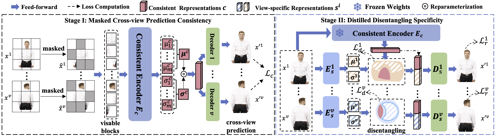

# MRDD
The official repos for ""Rethinking Multi-view Representation Learning via Distilled Disentangling"" (MRDD)

:star: I am really interested in "how to predict the missing view/modality via disentangling representations.". Please contact me if you have any potential ideas or if you want to discuss this topic with me. Thanks. ( guanzhouk [at] gmail.com or guanzhouk [at] bjtu.edu.cn both could find me. ) If you are also BJTU's student, you could directly face-to-face with me. 

## Abstract

Multi-view representation learning aims to derive robust representations that are both view-consistent and view-specific from diverse data sources. This paper presents an in-depth analysis of existing approaches in this domain, highlighting a commonly overlooked aspect: the redundancy between view-consistent and view-specific representations. To this end, we propose an innovative framework for multi-view representation learning, which incorporates a technique we term `distilled disentangling'.
Our method introduces the concept of \textit{masked cross-view prediction}, enabling the extraction of compact, high-quality view-consistent representations from various sources, without incurring extra computational overhead. Additionally, we develop a distilled disentangling module that efficiently filters out consistency-related information from multi-view representations, resulting in purer view-specific representations.
This approach significantly reduces redundancy between view-consistent and view-specific representations, enhancing the overall efficiency of the learning process. Our empirical evaluations reveal that higher mask ratios substantially improve the quality of view-consistent representations. Moreover, we find that reducing the dimensionality of view-consistent representations relative to that of view-specific representations further refines the quality of the combined representations.




- Status:  Accepted at CVPR 2024 (Poster).


## Training step

We show that how `MRDD` train on the `EdgeMnist` dataset.


1. train the consistent encoder.

We provide two ways to train the consistent encoder. First one is using distributed training manner:


```
torchrun --nproc_per_node=[GPU NUMS] --master-port=[PORT] train_consistency.py  -f [config file]`
```

In this setting, you should enable the term `use_ddp` in config file's `train` domain. As the same time, you could fill in the `devices` domain to declare how many GPUs that you want to use in training.

We also provide the single gpu version:
```
python train_consistency.py  -f [config file]
```

Also, you should disable the term `use_ddp`.


2. train the disentangling module.

For DDP:
```
torchrun --nproc_per_node=[GPU NUMS] --master-port=[PORT] train_disentangle.py  -f [config file]`
```
For single:
```
python train_disentangle.py  -f [config file]
```


## Validation

Note: you can find the pre-train weigths at [here](https://drive.google.com/file/d/1ihSw5NpUGdgEUEYKvZuLCo_hp3uJ26Yr/view?usp=sharing).  


```
python eval.py -f ./configs/dataset name/eval.yaml
```

And fill in the path of pretrained model to `model_path` domain.

